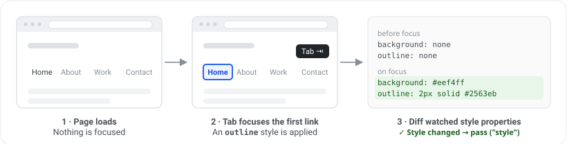

# @a11y-pulse/focus-appearance-audit

[](https://www.npmjs.com/package/@a11y-pulse/focus-appearance-audit)
[](https://github.com/A11y-Pulse/focus-appearance-audit/actions/workflows/ci.yml)
[](./LICENSE.md)

An accessibility audit that aims to verify compliance with [**WCAG 2.0: 2.4.7 Focus Visible**](https://www.w3.org/WAI/WCAG20/Understanding/focus-visible). It tabs through a page's focusable elements and detects whether each one shows a visible focus indicator. It is built to be framework-agnostic and can be used in any environment that allows you to programmatically focus elements and read their computed styles, such as Puppeteer, Playwright, or Selenium.

This audit was developed by [A11y Pulse](https://www.a11ypulse.com/) for its accessibility monitoring service. It is released as source-available under the [PolyForm Shield License 1.0.0](#license).

## Install

```bash
npm install @a11y-pulse/focus-appearance-audit puppeteer
```

`puppeteer` is an optional peer dependency — it's only required if you use the bundled [Puppeteer adaptor](#adaptors). Other frameworks can supply their own adaptor without installing Puppeteer at all.

## Quickstart

```js
import { runFocusAppearanceAudit } from "@a11y-pulse/focus-appearance-audit";
import { PuppeteerAdaptor } from "@a11y-pulse/focus-appearance-audit/puppeteer";
import puppeteer from "puppeteer";

const browser = await puppeteer.launch();
const page = await browser.newPage();
await page.goto("https://who.likesdogs.nz/");

const result = await runFocusAppearanceAudit(new PuppeteerAdaptor(page), {
  elementLimit: 20,
});

console.log(result.summary);
// { checked: 2, passed: 1, failed: 1, reachedLimit: false, reachedFailedElementLimit: false, timedOut: false }

console.log(result.elements);
// [
//   {
//     selector: 'html>body>button',
//     html: '<button>',
//     tabIndex: 1,
//     passed: true,
//     detectionMethod: 'style'
//   },
//   {
//     selector: 'html>body>section.wrap>article.pb-3>ul>li>a',
//     html: '<a href="https://github.com/wildlyinaccurate/second">',
//     tabIndex: 2,
//     passed: false,
//     detectionMethod: null
//   },
// ]

await browser.close();
```

See [`examples/puppeteer`](./examples/puppeteer) for a complete, runnable example.

## Options

The following options can be passed to `runFocusAppearanceAudit` as `FocusAppearanceOptions`:

| Option                    | Type      | Default             | Description                                                                                                                      |
| ------------------------- | --------- | ------------------- | ---------------------------------------------------------------------------------------------------------------------------------- |
| `elementLimit`            | `number`  | `1024`               | Max focusable elements to tab through.                                                                                           |
| `baselineElementLimit`    | `number`  | `elementLimit * 2`   | How many focusable elements to snapshot baseline styles for up front. Not all focusable elements are tabbable (e.g. elements inside menus or hidden containers), so this acts as a floor — the effective baseline budget is `max(elementLimit, baselineElementLimit)`. |
| `screenshotSettleDelay`   | `number`  | `33`                 | How long to wait (in ms) after each Tab for focus styles/transitions to settle.                                                  |
| `screenshotClipBuffer`    | `number`  | `10`                 | Padding (in px) around the element box for the pixel-diff screenshot.                                                            |
| `screenshotDiffThreshold` | `number`  | `4`                  | Number of pixels that must differ to consider an indicator present. Floored at `1`.                                              |
| `skipStyleCheck`          | `boolean` | `false`              | Skip the computed-style stage and run a pixel diff for every element. Much slower, but may reduce false positives in rare cases. |
| `failedElementLimit`      | `number`  | `0` (never)          | Finish the audit early once this many elements have failed, leaving the rest unchecked. Useful as a fail-fast signal when you only need to know a page has focus problems, not their full extent. |
| `timeout`                 | `number`  | `0` (no timeout)     | Limit how long (in ms) the audit runs before returning the results it has gathered so far.                                       |

## Result shape

`runFocusAppearanceAudit` resolves to a `FocusAppearanceResult`:

```ts
type FocusAppearanceResult = {
  /** Every focusable element that was checked, in tab order. */
  elements: Array<{
    selector: string;
    html: string;
    tabIndex: number;
    passed: boolean;
    detectionMethod: "style" | "pixel-diff" | null;
  }>;
  summary: {
    checked: number;
    passed: number;
    failed: number;
    /** True if `elementLimit` was hit before tabbing finished. */
    reachedLimit: boolean;
    /** True if the audit stopped early after hitting `failedElementLimit`. */
    reachedFailedElementLimit: boolean;
    /** True if the audit returned early because `timeout` elapsed. */
    timedOut: boolean;
  };
};
```

## Detection methods

Focus appearance detection runs in either one or two stages. The first stage is a fast and memory efficient comparison of computed styles. If no style changes are detected, a second stage captures screenshots of the focused element and compares them pixel by pixel. The second stage is more expensive but can detect focus appearance that does not show in computed styles.

### Stage 0: Preparation

At the beginning of the audit, a snapshot of each focusable element's computed styles is taken. This snapshot contains only [focus-relevant properties](./src/focus-style.ts) and the elements' `::before` & `::after` pseudo-elements. The audit then begins a loop of tabbing through each focusable element and running it through the next two stages.

### Stage 1: computed style comparison



Once an element is focused, its computed styles are captured again and compared to the baseline. If any property has changed, the element passes with `detectionMethod: "style"`; if not, it moves to Stage 2. This stage is very fast and has not produced any false positives in testing.

### Stage 2: pixel-diff fallback


Since focus appearance can be achieved without modifying style properties (a `filter`, an animated background), a more expensive pixel-diff fallback is used. In this stage, a clipped screenshot is taken of the element in both its focused and unfocused states. The two images are compared pixel by pixel, and if they differ beyond a certain threshold, the element passes with `detectionMethod: "pixel-diff"`.

## Accuracy

This audit is a heuristic and can be wrong in both directions. See [docs/accuracy.md](./docs/accuracy.md) for the known false positives, false negatives, and intentional failures.

## WCAG 2.0 2.4.7 (Focus Visible) vs WCAG 2.2 2.4.13 (Focus Appearance)

Both success criteria concern the keyboard focus indicator, but they set very different bars. [2.4.7 Focus Visible](https://www.w3.org/WAI/WCAG20/Understanding/focus-visible) is a Level AA criterion from WCAG 2.0 and is purely existential: when an element receives keyboard focus, some visible focus indicator must appear. It says nothing about how large or how visible that indicator has to be, so even a faint one-pixel outline satisfies it.

[2.4.13 Focus Appearance](https://www.w3.org/WAI/WCAG22/Understanding/focus-appearance) is a Level AAA criterion added in WCAG 2.2 that closes that gap. On top of requiring an indicator, it sets a minimum size (at least the area of a 2 CSS pixel thick perimeter of the component) and a minimum contrast (a ratio of at least 3:1 between the focused and unfocused states of the same pixels).

At the time of writing this audit only checks for 2.4.7. Experimental support for 2.4.13 will be added in a future release.

## Adaptors

The audit itself is framework-agnostic: it drives a page through an **adaptor**, a small interface of primitives (evaluate JS in the page, press Tab, take a clipped screenshot, etc.) that the audit calls without knowing which browser automation library is behind it.

The package ships one implementation, `PuppeteerAdaptor`, backed by a Puppeteer `Page`. Other environments (Playwright, Selenium, WebDriver) can be supported by implementing the same interface, exported as `FocusAppearanceAuditAdaptor` (aliased as `BrowserAdaptor` from the package root).

### `FocusAppearanceAuditAdaptor` / `BrowserAdaptor`

| Method                  | Description                                                                                                                                        |
| ----------------------- | ---------------------------------------------------------------------------------------------------------------------------------------------------- |
| `evaluate(fn, ...args)` | Runs `fn` in the page context, passing in any serialisable `args`, and returns its result.                                                          |
| `evaluateHandle(fn)`    | Runs `fn` in the page context and returns an opaque `ElementRef` handle to the `Element` it returns, without serialising it.                        |
| `disposeRef(ref)`       | Releases a handle previously returned by `evaluateHandle`.                                                                                           |
| `pressTab()`            | Presses the Tab key, advancing focus to the next focusable element.                                                                                  |
| `screenshotClip(clip)`  | Screenshots a clipped region of the page (`{ x, y, width, height }`) and returns PNG bytes.                                                          |
| `ensureFocusReporting()`| Ensures the page reports focus for its lifetime — in particular that `document.hasFocus()` works and `:focus` styles apply, even when the page is not the foreground tab/window. Must not throw. |

### Writing a new adaptor

Implement `FocusAppearanceAuditAdaptor` from `@a11y-pulse/focus-appearance-audit` (or its `BrowserAdaptor` alias) against your automation library's page/session object, then pass an instance to `runFocusAppearanceAudit`:

```ts
import type { BrowserAdaptor } from "@a11y-pulse/focus-appearance-audit";

class MyFrameworkAdaptor implements BrowserAdaptor {
  // ...implement evaluate, evaluateHandle, disposeRef, pressTab,
  // screenshotClip, and ensureFocusReporting for your framework
}
```

Use [`src/adaptors/puppeteer.ts`](./src/adaptors/puppeteer.ts) as a reference implementation — it's a small, self-contained example of every method the audit needs.

## Limitations

- **Chromium focus emulation.** Accurate `:focus`/`document.hasFocus()` reporting for a backgrounded page relies on Chromium's CDP focus emulation (used by `PuppeteerAdaptor.ensureFocusReporting`). Other browser engines may not offer an equivalent, and results may be less reliable if the page genuinely loses focus during the audit.
- **Tab order only.** The audit tabs through elements in native tab order. It does not yet exercise arrow-key composite widgets (menus, comboboxes, toolbars, etc.) where focus moves via `aria-activedescendant` or roving `tabindex` instead of native Tab.
- **Heuristic accuracy.** Detection is heuristic and can produce false positives and false negatives — see [Accuracy](#accuracy) and [docs/accuracy.md](./docs/accuracy.md) for known cases.

## License

Released under the [PolyForm Shield License 1.0.0](./LICENSE.md), in plain language:

- **Source-available.** The source is public and you can read, fork, and modify it.
- **Permitted for non-competing use.** You can use this package freely in your own products and services, as long as they don't compete with A11y Pulse.
- **Competing products are forbidden.** You may not use this software (or a modified version of it) to build a product or service that competes with A11y Pulse's accessibility monitoring offering.

See [LICENSE.md](./LICENSE.md) for the full, binding terms.
