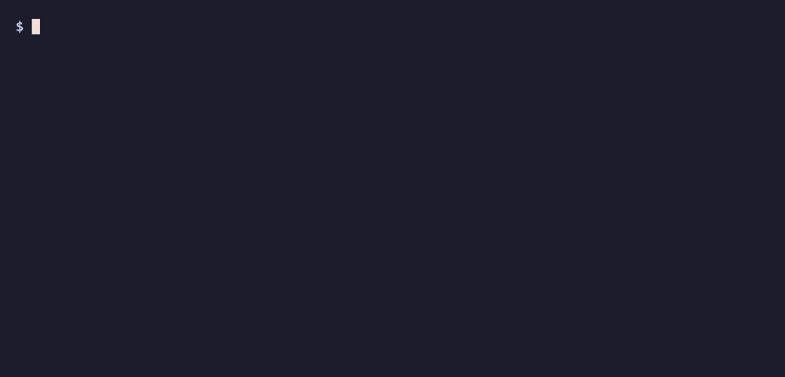

<p align="center">
    <a href="https://www.a11ypulse.com/?utm_source=github&utm_content=audits-logo" target="_blank">
        <picture>
            <source srcset="https://app.a11ypulse.com/images/a11y-pulse-logo-white.png" media="(prefers-color-scheme: dark)" />
            <source srcset="https://app.a11ypulse.com/images/a11y-pulse-logo.png" media="(prefers-color-scheme: light), (prefers-color-scheme: no-preference)" />
            
        </picture>
    </a>
</p>

<p align="center">
    <a href="https://github.com/A11y-Pulse/audits/actions/workflows/ci.yml"></a>
    <a href="https://github.com/A11y-Pulse/audits/actions/workflows/release.yml"></a>
    <a href="https://www.npmjs.com/package/@a11y-pulse/audit-runner"></a>
    <a href="https://www.npmjs.com/package/@a11y-pulse/audit-runner"></a>
    <a href="https://polyformproject.org/licenses/shield/1.0.0/"></a>
</p>

# Automated accessibility audits that go beyond axe-core

Browser-based WCAG testing for things static accessibility scanners like axe-core and Lighthouse can't test. Works with Puppeteer, Playwright, or your own browser automation. Developed by the [A11y Pulse](https://www.a11ypulse.com/?utm_source=github&utm_content=audits-lead) team.



## Coverage

| Success criterion | A11y-Pulse/audits | axe-core | pa11y (HTML_CodeSniffer) |
| --- | --- | --- | --- |
| [2.4.7 Focus Visible](https://www.w3.org/WAI/WCAG22/Understanding/focus-visible) (AA) | ✅ | ❌ | 🟡<sup>1</sup> |
| [2.4.11 Focus Not Obscured (Minimum)](https://www.w3.org/WAI/WCAG22/Understanding/focus-not-obscured-minimum) (AA) | ✅ | ❌ | ❌ |
| [3.2.1 On Focus](https://www.w3.org/WAI/WCAG22/Understanding/on-focus) (A) | ✅ | ❌ | 🟡<sup>1</sup> |
| [1.4.10 Reflow](https://www.w3.org/WAI/WCAG22/Understanding/reflow) (AA) | ✅ | ❌ | 🟡<sup>1</sup> |
| [1.4.12 Text Spacing](https://www.w3.org/WAI/WCAG22/Understanding/text-spacing) (AA) | ✅ | 🟡<sup>2</sup> | 🟡<sup>1</sup> |
| [2.4.1 Bypass Blocks](https://www.w3.org/WAI/WCAG22/Understanding/bypass-blocks) (A) | ✅ | 🟡<sup>3</sup> | 🟡<sup>1</sup> |

<small>
1. Manual review only: emits a note asking a human to check the criterion.<br />
2. The `avoid-inline-spacing` audit only flags inline `!important` spacing declarations.<br />
3. The `bypass` audit only checks that a bypass mechanism exists, not that it works.<br />
</small>

## Quick Start

We recommend using the [`@a11y-pulse/audit-runner` package](./packages/audit-runner) as an example of how to integrate these audits into your own pipeline. However this package can also be run as a CLI to audit a single URL:

```bash
npx @a11y-pulse/audit-runner https://example.com
```

Individual audits can also be used on their own. See the README in each package for details.

## Packages

| Package | npm | What it checks |
| --- | --- | --- |
| [`@a11y-pulse/focus-appearance-audit`](./packages/focus-appearance-audit) | [@a11y-pulse/focus-appearance-audit](https://www.npmjs.com/package/@a11y-pulse/focus-appearance-audit) | [WCAG 2.4.7 Focus Visible](https://www.w3.org/WAI/WCAG22/Understanding/focus-visible): tabs through a page and detects a visible focus indicator |
| [`@a11y-pulse/focus-not-obscured-audit`](./packages/focus-not-obscured-audit) | [@a11y-pulse/focus-not-obscured-audit](https://www.npmjs.com/package/@a11y-pulse/focus-not-obscured-audit) | [WCAG 2.4.11 Focus Not Obscured (Minimum)](https://www.w3.org/WAI/WCAG22/Understanding/focus-not-obscured-minimum): tabs through a page and detects focused elements entirely hidden behind other content |
| [`@a11y-pulse/context-change-on-focus-audit`](./packages/context-change-on-focus-audit) | [@a11y-pulse/context-change-on-focus-audit](https://www.npmjs.com/package/@a11y-pulse/context-change-on-focus-audit) | [WCAG 3.2.1 On Focus](https://www.w3.org/WAI/WCAG22/Understanding/on-focus): tabs through a page and detects focus-triggered context changes (new windows, auto-submits, navigation, focus theft/removal) |
| [`@a11y-pulse/reflow-audit`](./packages/reflow-audit) | [@a11y-pulse/reflow-audit](https://www.npmjs.com/package/@a11y-pulse/reflow-audit) | [WCAG 1.4.10 Reflow](https://www.w3.org/WAI/WCAG22/Understanding/reflow): narrows to 320px and measures two-dimensional scrolling |
| [`@a11y-pulse/skip-link-audit`](./packages/skip-link-audit) | [@a11y-pulse/skip-link-audit](https://www.npmjs.com/package/@a11y-pulse/skip-link-audit) | [WCAG 2.4.1 Bypass Blocks](https://www.w3.org/WAI/WCAG22/Understanding/bypass-blocks.html): when a skip-link-like in-page anchor is in the first tab stops, verifies that activating it moves keyboard focus |
| [`@a11y-pulse/text-spacing-audit`](./packages/text-spacing-audit) | [@a11y-pulse/text-spacing-audit](https://www.npmjs.com/package/@a11y-pulse/text-spacing-audit) | [WCAG 1.4.12 Text Spacing](https://www.w3.org/WAI/WCAG22/Understanding/text-spacing): injects the SC spacing overrides and detects clipped or overlapping text |
| [`@a11y-pulse/browser-adaptor`](./packages/browser-adaptor) | [@a11y-pulse/browser-adaptor](https://www.npmjs.com/package/@a11y-pulse/browser-adaptor) | Shared browser adaptor primitives (`BrowserAdaptor`, `PuppeteerAdaptor`) and DOM helpers (`getSelector`, `truncateHtml`) used by audit packages |
| [`@a11y-pulse/tab-orchestrator`](./packages/tab-orchestrator) | [@a11y-pulse/tab-orchestrator](https://www.npmjs.com/package/@a11y-pulse/tab-orchestrator) | Orchestrator that drives a page once so multiple tab-driven audits can share a single tab loop |
| [`@a11y-pulse/audit-runner`](./packages/audit-runner) | [@a11y-pulse/audit-runner](https://www.npmjs.com/package/@a11y-pulse/audit-runner) | CLI that runs axe-core and all A11y Pulse audits |

## Licence

The packages in this repository are split into two licence categories:

- **The audit packages are [PolyForm Shield 1.0.0](./LICENSE.md).** This means they are source-available and can be used freely, including commercially and in your own internal monitoring, as long as you are not building something that competes with A11y Pulse.
- **The plumbing packages are [MIT](./packages/browser-adaptor/LICENSE.md).** `browser-adaptor`,
  `tab-orchestrator`, and `audit-runner` can all be used freely with almost no restrictions.

Please read the `LICENSE.md` file for each package to understand the specific terms of use.

## Contributing

Adaptors, new criteria and accuracy fixes are all welcome. See
[CONTRIBUTING.md](./CONTRIBUTING.md) for Changesets and pull-request expectations, and the
[open issues](https://github.com/A11y-Pulse/audits/issues) for work that is ready to pick up.

Requires Node.js `>=22`.

```bash
git clone https://github.com/A11y-Pulse/audits.git
cd audits
npm install
npm test                 # typecheck + unit tests
npm run test:integration # real Chromium via Puppeteer
npm run lint
```

## About A11y Pulse

[A11y Pulse](https://www.a11ypulse.com/?utm_source=github&utm_content=audits-about) is a web
accessibility monitoring platform. It scans websites for accessibility issues using real web
browsers, making it easier to reach WCAG compliance and maintain accessibility over time. A11y
Pulse combines these audits with other open-source accessibility testing frameworks to provide more
coverage than most other tools.
