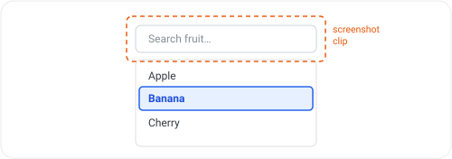
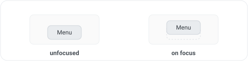

# Accuracy: false positives and false negatives

This audit is a heuristic. It reaches the right answer for the overwhelming majority of real focus styles, but it can be wrong in both directions. This document records the known cases so the results can be interpreted with the right caveats.

Automated accessibility testing should always be complementary to manual testing. In that context, this audit has been intentionally designed to prefer false positives over false negatives. False negatives cause noisy results that can reduce overall confidence, whereas false positives can be caught during manual testing.

## False positives

The following scenarios will cause the audit to report a **pass** even though the element does not have a perceivable focus indicator.

### The indicator has no contrast

If an element's focus style changes but the resulting indicator has no contrast against the background, the audit reports a **pass** with `detectionMethod: "style"`, even though the focus indicator is not visible.

> [!NOTE]
> This case can be mitigated by using `skipStyleCheck: true` and relying on the much slower pixel diff.

| property | unfocused | on focus |
| --- | --- | --- |
| `outline-width` (watched) | `0px` | `3px` |
| `outline-style` (watched) | `none` | `solid` |
| `outline-color` (watched) | `#223` | `#fff` |

The style comparison detects that an outline was added, so the element passes the audit. However the white (`#fff`) outline is invisible against the white background, so the element does not actually have a perceivable focus indicator.

### Ambient motion fools the pixel diff

When the style comparison finds nothing, the pixel diff captures the element plus a small buffer. Any unrelated change inside that buffer can cause the pixel diff to see changes that are not focus indicators, such as animations or blinking text.

| property | unfocused | on focus |
| --- | --- | --- |
| _(none of the watched properties change)_ | | |

The element has no focus style but the neighbouring spinner moved between screenshot captures, so the diff is non-empty. The audit reports a **pass** with `detectionMethod: "pixel-diff"`.

## False negatives

The following scenarios will cause the audit to report a **failure** when a real, visible indicator exists.

### The indicator is rendered outside the element

If the visible focus indication is drawn outside the focused element's box, the audit reports a **failure**: the element's own watched styles do not change, and the pixel diff only captures its box plus a small buffer.

Possible cases are the highlighted active option of an `aria-activedescendant` combobox or listbox, or a remote "you are here" marker. In the example the input is focused and its own appearance does not change, but the highlighted option in the combobox acts as the indicator and lies outside the screenshotted region.

| property (the focused input) | unfocused | on focus |
| --- | --- | --- |
| _(the focused element's watched properties are unchanged)_ | | |

The audit will report a **fail** with `detectionMethod: null`.

## Intentional failures

### The only change is movement

Layout-only properties like `margin`, `padding`, and `transform` are deliberately ignored when determining focus appearance. When performing a pixel diff, the screenshots are re-framed to align with the element's position, so a pure positional shift is ignored.

| property | unfocused | on focus |
| --- | --- | --- |
| `transform` _(not watched)_ | `none` | `translateY(-8px)` |

The audit reports a **fail** with `detectionMethod: null`.
